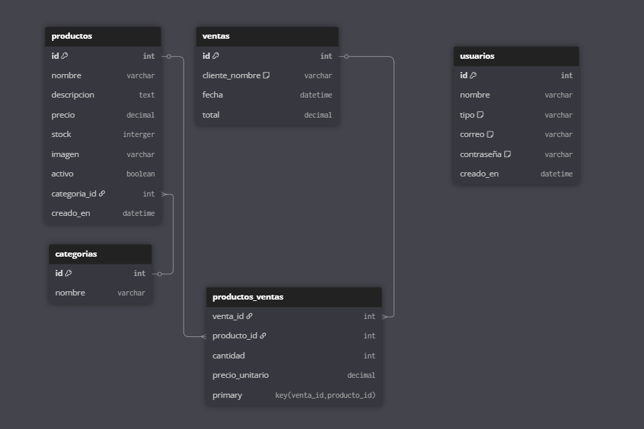

# 🧽 R.E.P.O. \- Sistema de Autoservicio de Limpieza

# **📌 Descripción del Proyecto**

R.E.P.O. es una aplicación web Full Stack desarrollada para la gestión integral de un servicio de autoservicio de limpieza. Permite al personal administrativo controlar productos, ventas, usuarios y categorías, todo desde una interfaz sencilla e intuitiva.

Este sistema está diseñado para negocios que ofrecen servicios de limpieza tipo autoservicio, como lavanderías o estaciones de lavado. A través de una interfaz web, los administradores pueden:  
\- Gestionar productos utilizados en el servicio  
\- Controlar el stock y la disponibilidad  
\- Registrar ventas y operaciones  
\- Administrar usuarios y sus permisos

# **🛠️ Tecnologías Utilizadas**

* Backend:

\- Node.js \+ Express  
\- Sequelize ORM \+ MySQL  
\- JWT para autenticación  
\- bcrypt para encriptación de contraseñas  
\- express-validator para validaciones

* Frontend:

\- HTML5  
\- CSS3  
\- JavaScript (Vanilla)  
\- Bootstrap (estilos)  
\- SweetAlert2 (alertas interactivas)

# **🔐 Autenticación y Roles**

Registro y login de usuarios con tokens JWT. Roles diferenciados:  
\- Administrador: acceso completo a la gestión  
\- Usuario común: acceso limitado  
Las vistas se ajustan dinámicamente en el frontend según el rol detectado.

# **✨ Funcionalidades ya implementadas**

* ✅ Autenticación (login con token y validación de rol)  
* ✅ Alta y baja lógica de productos  
* ✅ Edición de productos  
* ✅ Subida y almacenamiento de imágenes  
* ✅ Validaciones en backend con express-validator  
* ✅ Middleware de protección por rol  
* ✅ Asociación de productos a ventas  
* ✅ CRUD de categorías  
* ✅ Control de stock  
* ✅ Registro de ventas  
* ✅ Panel de administración  
* ✅ Interfaz dinámica con JavaScript

# **⚙️ Instalación y uso**

Requisitos:  
\- Node.js  
\- MySQL

Pasos:  
1\. Clonar el repositorio:  
   git clone https://github.com/tu-usuario/repo-autoservicio.git  
2\. Instalar dependencias del backend:  
   cd backend && npm install  
3\. Crear archivo .env con configuración de base de datos  
5\. Iniciar backend:  
   node app.js  
6\. Abrir /frontend/inicio.html

# **📦 Base de datos**

Relaciones:  
\- Un Usuario puede realizar muchas Ventas  
\- Una Venta puede incluir varios Productos (relación muchos a muchos mediante ProductoVenta)  
\- Un Producto pertenece a una Categoria

# **📊 Modelo Entidad-Relación (ER)**

# **🧑‍💻 Autores**

Luciano Bordon, Pio Acosta  
